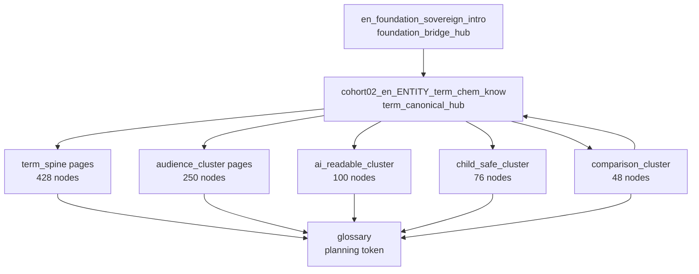

# COHORT_02 — Internal Link Graph

**Sprint:** 6J  
**Cohort:** `COHORT_02_EN_TERMINOLOGY_SPINE`  
**Date:** 2026-05-30  
**Posture:** Planning graph only — **no live markdown links**, **no public HTML**, **no navigation activation**

---

## Purpose

Define the governed internal-link graph for **902** non-public COHORT_02 terminology drafts. All edges use `route_id` references for future wiring. This document is the authoritative COHORT_02 link plan aligned with `INITIAL_14000_PAGE_LAUNCH_INTERNAL_LINK_REQUIREMENTS.md`, `CORPUS_PRODUCTION_LINK_GRAPH_MODEL.md`, and Sprint 6E foundation graph discipline.

---

## Graph statistics

| Metric | Value |
| --- | ---: |
| COHORT_02 nodes (drafts) | 902 |
| Outbound edges to registered foundation routes | 1,804 |
| Outbound edges within COHORT_02 | 950 |
| Planning glossary token references | 902 |
| Entity term hubs (canonical) | 50 |
| Comparison cluster nodes | 48 |
| AI-readable cluster nodes | 100 |
| Child-safe cluster nodes | 76 |
| Broken route_id references in drafts | **0** |
| Broken route_id references in inventory | **0** |

---

## Hub and cluster classification

### Tier 0 — External foundation bridge (registered, not COHORT_02)

| route_id | Role | Graph type |
| --- | --- | --- |
| `en_foundation_sovereign_intro` | Sovereign reference introduction | **foundation_bridge_hub** |

**Required on all 902 COHORT_02 nodes:** outbound edge to `en_foundation_sovereign_intro`.

### Tier 1 — Entity terminology hubs (50 entities)

Each entity has a canonical terminology hub:

**Pattern:** `cohort02_en_{term_entity_id}_term_chem_know`  
**Hub type:** `term_canonical_hub`  
**page_type_id:** PT_TERM_CANONICAL  
**audience_id:** AUD_CHEMIST  
**reference_layer_id:** REF_KNOWLEDGE

Examples:

| term_entity_id | Hub route_id |
| --- | --- |
| bisulfid | `cohort02_en_bisulfid_term_chem_know` |
| bisulfide | `cohort02_en_bisulfide_term_chem_know` |
| molybdenum_disulfide | `cohort02_en_molybdenum_disulfide_term_chem_know` |
| sulfur | `cohort02_en_sulfur_term_chem_know` |
| thiosulfate | `cohort02_en_thiosulfate_term_chem_know` |

### Tier 2 — Page-type cluster hubs

| Cluster | internal_link_role | Count | Hub type |
| --- | --- | ---: | --- |
| Canonical / compound spine | term_spine | 428 | term_spine_cluster |
| Audience explainers | audience_cluster | 250 | audience_layer_hub |
| AI-readable records | ai_readable_cluster | 100 | ai_readable_hub |
| Child-safe educational | child_safe_cluster | 76 | education_hub |
| Difference/comparison | comparison_cluster | 48 | comparison_hub |

### Tier 3 — Reference-layer sub-clusters

Within each entity, reference-layer variants form sub-clusters anchored to the Tier 1 entity hub:

| reference_layer_id | Typical route pattern | Spoke type |
| --- | --- | --- |
| REF_ACADEMIC | `*_term_chem_acad` | academic_spoke |
| REF_RESEARCH | `*_term_res_res`, `*_air_res_res` | research_spoke |
| REF_KNOWLEDGE | `*_term_*_know`, `*_aud_*_know` | knowledge_spoke |
| REF_TECHNICAL | `*_term_ai_tech`, `*_air_ai_tech` | technical_spoke |
| REF_EDUCATIONAL | `*_aud_stu_edu`, `*_term_stu_*` | educational_spoke |
| REF_LINGUISTIC | `*_term_stu_ling`, `*_vs_*_chem_ling` | linguistic_spoke |
| REF_INSTITUTIONAL | `*_aud_gov_inst` | institutional_spoke |

### Tier 4 — Comparison/difference hubs (12 pairs × 4 reference modes)

**Pattern:** `cohort02_en_{side_a}_vs_{side_b}_{ref_mode}`  
**Hub type:** `comparison_hub`  
**Required side anchors:** both entity Tier 1 hubs for comparison sides

Example pair (bisulfid vs bisulfide):

| route_id | reference_layer |
| --- | --- |
| `cohort02_en_bisulfid_vs_bisulfide_chem_ling` | REF_LINGUISTIC |
| `cohort02_en_bisulfid_vs_bisulfide_res_res` | REF_RESEARCH |
| `cohort02_en_bisulfid_vs_bisulfide_stu_edu` | REF_EDUCATIONAL |
| `cohort02_en_bisulfid_vs_bisulfide_ai_tech` | REF_TECHNICAL |

---

## Graph diagram (planning — simplified)



Solid arrows = **required** hub-spoke pattern. `ENTITY` is a placeholder for each of 50 entity hubs.

---

## Required links (by node class)

### Universal required outbound (all 902 nodes)

| Source class | Required targets |
| --- | --- |
| All COHORT_02 nodes | `en_foundation_sovereign_intro`, entity `term_chem_know` hub (unless self), `glossary` (planning token) |

**Inventory verification:** 902/902 include foundation bridge; 902/902 include entity hub where applicable; 902/902 include glossary token.

### Entity spoke required outbound

| Source class | Required targets |
| --- | --- |
| PT_TERM_CANONICAL (non-hub variants) | Entity hub, foundation bridge |
| PT_AUDIENCE_EXPLAINER | Entity hub, foundation bridge |
| PT_COMPOUND_ENTITY | Entity hub, foundation bridge |
| PT_AI_READABLE | Entity hub, foundation bridge |
| PT_CHILD_SAFE_EDU | Entity hub, foundation bridge |
| PT_DIFFERENCE_COMPARISON | Both side entity hubs, foundation bridge |

**Inventory verification:** 0 missing entity hub links; 0 missing comparison side hub links.

### High-inbound entity hubs (top 10 by cohort inbound count)

| Hub route_id | Inbound cohort edges |
| --- | ---: |
| `cohort02_en_sulfide_term_chem_know` | 39 |
| `cohort02_en_bisulfide_term_chem_know` | 29 |
| `cohort02_en_sulfate_term_chem_know` | 27 |
| `cohort02_en_disulfide_term_chem_know` | 23 |
| `cohort02_en_molybdenum_disulfide_term_chem_know` | 23 |
| `cohort02_en_thiosulfate_term_chem_know` | 23 |
| `cohort02_en_sulfite_term_chem_know` | 23 |
| `cohort02_en_sodium_bisulfide_term_chem_know` | 21 |
| `cohort02_en_sodium_hydrosulfide_term_chem_know` | 21 |
| `cohort02_en_sulfid_term_chem_know` | 19 |

---

## Optional links

| Source | Optional targets | Rationale |
| --- | --- | --- |
| Entity hub | sibling reference-layer variants within same entity | Cross-layer discovery |
| Audience explainer | AI-readable variant of same entity | Audience ↔ machine-readable boundary |
| Comparison hub | linguistic spoke of each side | Terminology boundary depth |
| Any term_spine page | comparison hub if entity participates in pair | Comparison cluster discovery |
| AI-readable node | child-safe node for same entity | Education boundary cross-reference |

Optional edges may be added during route merge; they are not merge-blocking for Sprint 6J graph validation.

---

## Prohibited links

| Pattern | Reason |
| --- | --- |
| Any COHORT_02 page → public terminology URL as if live | Routes not registered; no public HTML |
| Any COHORT_02 page → external market/safety/procurement URLs | Forbidden claim class context |
| Comparison page → winner/factual distinction without source | Unsupported comparison claim |
| Any link implying `production_can_safely_proceed: yes` | False readiness signal |
| Any link treating `[SOURCE REQUIRED]` as resolved | Marker preservation |
| Doorway loops without entity hub anchor | SEO/security model violation |
| Live markdown `<a href>` in draft files before route merge | Pre-registration discipline |
| COHORT_02 → unregistered route_id outside inventory/manifest | Broken graph edge |

---

## Circular-link policy

1. **Allowed controlled cycles:** reference-layer variants within same entity (hub ↔ spoke ↔ hub).
2. **Hub anchor rule:** Every cycle must include the entity `term_chem_know` hub in the shortest path.
3. **Maximum cycle depth:** 4 edges within a single entity subgraph.
4. **Forbidden:** Cycles that bypass foundation bridge when connecting cross-entity pages.
5. **Comparison pairs:** comparison hub → side A hub → side B hub → comparison hub is allowed for planning only; must not render as live navigation until source-supported.

---

## Orphan prevention

| Rule | Enforcement |
| --- | --- |
| Every node has ≥1 outbound required edge | ✓ (902/902) |
| Every entity subgraph anchored by Tier 1 hub | ✓ (50/50) |
| Every non-hub spoke links to entity hub | ✓ (0 missing) |
| Foundation bridge on all nodes | ✓ (902/902) |
| Comparison pages link both side hubs | ✓ (0 missing) |
| High-inbound hubs receive cluster traffic | ✓ (50 hubs with inbound) |

**Planning orphan note:** 852 nodes have zero *inbound* cohort edges — expected for leaf spokes in a hub-spoke model. Orphan prevention is enforced via **required outbound to entity hub + foundation bridge**, not mandatory inbound from all peers.

**Broken reference count:** **0**.

---

## Breadcrumbs (future, not activated)

When routes are registered and navigation authorized:

```text
Home (future) > Terminology > {term_entity_id} > {page h1}
```

| page_type_id | Planned breadcrumb |
| --- | --- |
| PT_TERM_CANONICAL | `Terminology > {entity} > Reference` |
| PT_AUDIENCE_EXPLAINER | `Terminology > {entity} > {audience}` |
| PT_COMPOUND_ENTITY | `Terminology > {entity} > Compound` |
| PT_AI_READABLE | `Terminology > {entity} > AI Reference` |
| PT_CHILD_SAFE_EDU | `Terminology > {entity} > Learn` |
| PT_DIFFERENCE_COMPARISON | `Terminology > Compare > {A} vs {B}` |

Breadcrumbs are **documentation-only** in Sprint 6J. No navigation JSON or HTML emitted.

---

## Future route registration readiness

See `COHORT_02_ROUTE_REGISTRATION_READINESS_REPORT.md`. All paths follow `/en/terminology/{entity}/...` from inventory `route_path` values.

---

## Future navigation eligibility

| Page class | Navigation eligible (future) | Default now |
| --- | --- | --- |
| term_canonical_hub | Yes — entity entry point | **not activated** |
| term_spine spoke | Conditional — nested under entity | **not activated** |
| comparison_hub | Conditional — compare section | **not activated** |
| ai_readable_hub | No default nav — machine-readable layer | **not activated** |
| child_safe_cluster | Conditional — education section | **not activated** |

**Sprint 6J default:** `in_navigation: false` on all 902 units.

---

## Future sitemap eligibility

| Page class | Sitemap eligible (future) | Default now |
| --- | --- | --- |
| All COHORT_02 drafts | Only after indexation charter + source/claim gates | **not activated** |

**Sprint 6J default:** `in_sitemap: false` on all 902 units.

---

## No-publication default

- Planning graph edges are `route_id` references only.
- No markdown `<a href>` links added to draft files in Sprint 6J.
- No `internal_links.json` modification.
- No `routes.json` modification.
- Graph validation is merge-blocking for future route registration sprints only.

---

*Sprint 6J — COHORT_02 Internal Link Graph (planning)*
