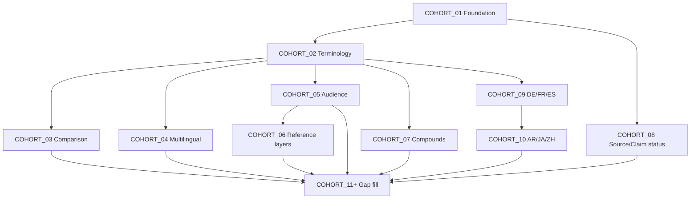

# Initial 14,000-Page Launch Cohort Sequence

**Sprint:** 6G  
**Date:** 2026-05-30  
**Posture:** Sequencing model — execution order for launch corpus build-out

---

## Sequencing principle

Cohorts execute in **dependency order**: foundation → spine terminology → comparison intent → multilingual → audience/reference layers → compounds → source/claim posture → language expansion. Each cohort is registry-constrained, validator-gated, and non-public until launch charter.

**No cohort skips upstream governance or link-graph prerequisites.**

---

## Phase map

| Phase | Cohort | Focus | Lang | Target pages | Status |
| ---: | --- | --- | --- | ---: | --- |
| 0 | **COHORT_01** | Foundation / governance | en | 15 | **Complete** (6D–6F) |
| 1 | **COHORT_02** | Core terminology spine | en | 500–800 | Next (6H) |
| 2 | **COHORT_03** | Difference / comparison | en | 200–400 | Planned |
| 3 | **COHORT_04** | Multilingual equivalence (DE/EN priority) | en, de | 300–500 | Planned |
| 4 | **COHORT_05** | Audience layer explainers | en | 400–600 | Planned |
| 5 | **COHORT_06** | Reference layer expansions | en | 300–500 | Planned |
| 6 | **COHORT_07** | Compound / entity pages | en | 200–400 | Planned |
| 7 | **COHORT_08** | Source / claim status & boundary | en | 200–300 | Planned |
| 8 | **COHORT_09** | DE / FR / ES language waves | de, fr, es | 1,500+ each wave | Planned |
| 9 | **COHORT_10** | AR / JA / ZH language waves | ar, ja, zh | 1,500+ each wave | Planned |
| 10 | **COHORT_11+** | Launch remainder + gap fill | all 7 | balance to 14,000 | Planned |

---

## Cohort detail

### COHORT_01 — Foundation / governance (complete)

- **Scope:** 15 EN foundation pages; institutional purpose, methodology, reliability, policies, status
- **Page types:** PT_FOUNDATION, PT_METHODOLOGY_GOVERNANCE, PT_CORPUS_STATUS
- **Posture:** claim_not_required; source_not_required; all noindex
- **Delivered:** Engine v1 drafts, 6E link graph, 6F route registration

### COHORT_02 — Core terminology spine (6H target)

- **Scope:** Canonical term pages for sulfur terminology spine (bisulfid, sulfid, bisulfide, disulfide, etc.)
- **Page types:** PT_TERM_CANONICAL, PT_GLOSSARY_CLUSTER
- **Reference layers:** REF_ACADEMIC, REF_KNOWLEDGE, REF_LINGUISTIC
- **Audiences:** AUD_CHEMIST, AUD_RESEARCHER, AUD_STUDENT
- **Blockers:** Factual lines remain `[SOURCE REQUIRED]` until source/claim gates clear
- **6H deliverable:** Master inventory rows / wave manifest (500–1,000 EN routes)

### COHORT_03 — Difference / comparison

- **Scope:** High-intent distinction pages (bisulfid vs bisulfide, sulfid vs sulfide, etc.)
- **Page types:** PT_DIFFERENCE_COMPARISON
- **Reference layers:** REF_LINGUISTIC, REF_RESEARCH, REF_EDUCATIONAL
- **Requires:** comparison_pair entities registered in ontology
- **SEO role:** Core launch SEO family — indexation candidate only after validation

### COHORT_04 — Multilingual equivalence

- **Scope:** DE/EN chemical-language equivalence; hreflang group binding
- **Page types:** PT_MULTILINGUAL_EQUIV, PT_MULTILINGUAL_HUB
- **Reference layers:** REF_LINGUISTIC, REF_INSTITUTIONAL
- **Requires:** COHORT_02 EN spine + verified terminology governance for cross-language links

### COHORT_05 — Audience layer explainers

- **Scope:** Same term/entity × distinct audience vocabulary and claim boundaries
- **Page types:** PT_AUDIENCE_EXPLAINER
- **Reference layers:** REF_KNOWLEDGE, REF_RESEARCH, REF_EDUCATIONAL, REF_ECONOMIC
- **Anti-duplication:** Audience label alone does not justify duplicate if reference layer unchanged

### COHORT_06 — Reference layer pages

- **Scope:** Distinct reference-layer surfaces for high-value entities
- **Page types:** PT_TERM_CANONICAL, PT_AUDIENCE_EXPLAINER, PT_AI_READABLE
- **Reference layers:** All 9 represented per eligibility matrix
- **Requires:** reference_layer_registry anti-duplication pass

### COHORT_07 — Compound / entity

- **Scope:** MoS₂, FeS, Na₂S, and compound-class reference pages
- **Page types:** PT_COMPOUND_ENTITY
- **Reference layers:** REF_ACADEMIC, REF_RESEARCH, REF_TECHNICAL, REF_LOGISTICAL
- **Blockers:** No operational handling or procurement content

### COHORT_08 — Source / claim status

- **Scope:** Source-bound, claim-boundary, source-status, claim-status pages
- **Page types:** PT_SOURCE_BOUND, PT_CLAIM_BOUNDARY, PT_SOURCE_STATUS, PT_CLAIM_STATUS
- **Posture:** Documents registry state — does not approve claims or register sources
- **Requires:** Active source/claim registry rows for bound pages

### COHORT_09–10 — Language expansion waves

- **Order:** de → fr → es → ar → ja → zh (chemical-language priority for de)
- **Per language target:** 2,000 pages at full launch
- **Wave size:** 500–2,000 rows per automation run
- **Requires:** EN institutional review + hreflang group completeness per theme

### COHORT_11+ — Gap fill to 14,000

- Government / investor / company context pages
- Child-safe and AI-readable slices
- Remaining glossary clusters
- Inventory reconciliation against composition model

---

## Cross-cohort dependencies

---

## Automation wave sizing

| Cohort class | Rows per wave | Draft pages/day (min → target) |
| --- | ---: | --- |
| Foundation / governance | 15–50 | 100 |
| Terminology spine | 500–1,000 | 100 → 500 |
| Comparison | 200–400 | 100 → 500 |
| Language expansion | 1,000–2,000 | 500 |
| Gap fill | 500–1,000 | 500 |

---

## Sprint 6H assignment

**COHORT_02 route inventory generation** — emit governed inventory rows for the first large EN terminology launch cohort (500–1,000 routes). No publication. No HTML. Executable manifest only.

---

*Sprint 6G — Launch Cohort Sequence*
