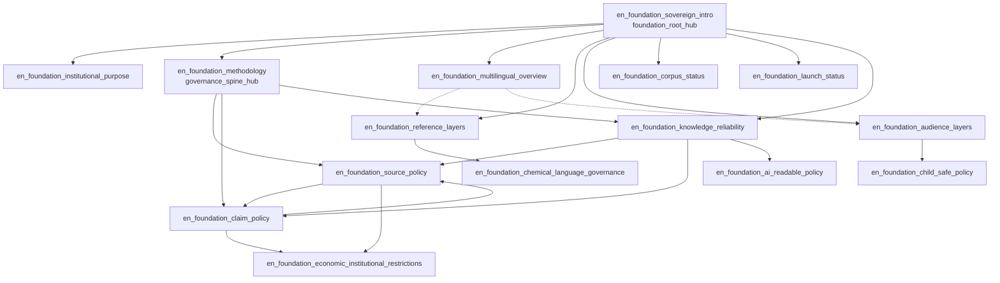

# Sovereign Foundation COHORT_01 — Internal Link Graph

**Sprint:** 6E  
**Cohort:** `COHORT_01_FOUNDATION_GOV`  
**Date:** 2026-05-30  
**Posture:** Planning graph only — **no live markdown links**, **no public HTML**, **no navigation activation**

---

## Purpose

Define the governed internal-link graph for 15 non-public foundation drafts. Edges use `route_id` references for future wiring. This document is the authoritative COHORT_01 link plan aligned with `CORPUS_PRODUCTION_LINK_GRAPH_MODEL.md` and `SOVEREIGN_SEO_INTERNAL_LINKING_SECURITY_MODEL_WAVE_1.md`.

---

## Hub and spoke classification

### Tier 0 — Root hub

| route_id | Role | Hub type |
| --- | --- | --- |
| `en_foundation_sovereign_intro` | Sovereign reference introduction | **foundation_root_hub** |

### Tier 1 — Primary hubs

| route_id | Role | Hub type |
| --- | --- | --- |
| `en_foundation_institutional_purpose` | Institutional purpose | foundation_about_hub |
| `en_foundation_methodology` | Corpus methodology | **governance_spine_hub** |
| `en_foundation_multilingual_overview` | Multilingual corpus | language_hub |
| `en_foundation_reference_layers` | Reference layers | knowledge_architecture_hub |
| `en_foundation_audience_layers` | Audience layers | audience_hub |
| `en_foundation_corpus_status` | Corpus status | status_hub |
| `en_foundation_launch_status` | Launch / non-public posture | status_hub |

### Tier 2 — Governance spine spokes

| route_id | Role | Spoke type |
| --- | --- | --- |
| `en_foundation_source_policy` | Source policy | source_hub |
| `en_foundation_claim_policy` | Claim policy | claim_hub |
| `en_foundation_knowledge_reliability` | Knowledge reliability model | reliability_hub |

### Tier 3 — Specialized policy spokes

| route_id | Role | Spoke type |
| --- | --- | --- |
| `en_foundation_chemical_language_governance` | Chemical-language governance | term_hub |
| `en_foundation_ai_readable_policy` | AI-readable reference policy | AI_reference_hub |
| `en_foundation_child_safe_policy` | Child-safe educational policy | education_hub |
| `en_foundation_economic_institutional_restrictions` | Economic/institutional restrictions | economic_governance_spoke |

---

## Graph diagram (planning)



Solid arrows = **required** edges. Dotted = **optional** edges.

---

## Required links (by source route_id)

Each required edge is **mandatory in the planning graph** before any publication charter. Draft markdown must not render these as live `<a href>` until routes are registered and indexation approved.

| Source | Required targets |
| --- | --- |
| `en_foundation_sovereign_intro` | institutional_purpose, methodology, knowledge_reliability, multilingual_overview, reference_layers, audience_layers, corpus_status, launch_status |
| `en_foundation_institutional_purpose` | sovereign_intro, methodology |
| `en_foundation_methodology` | source_policy, claim_policy, knowledge_reliability |
| `en_foundation_source_policy` | methodology, claim_policy |
| `en_foundation_claim_policy` | methodology, source_policy |
| `en_foundation_knowledge_reliability` | methodology, source_policy, claim_policy |
| `en_foundation_multilingual_overview` | sovereign_intro, reference_layers |
| `en_foundation_reference_layers` | sovereign_intro, audience_layers, chemical_language_governance |
| `en_foundation_audience_layers` | sovereign_intro, reference_layers, child_safe_policy |
| `en_foundation_chemical_language_governance` | reference_layers, methodology |
| `en_foundation_ai_readable_policy` | knowledge_reliability, methodology |
| `en_foundation_child_safe_policy` | audience_layers, claim_policy |
| `en_foundation_economic_institutional_restrictions` | claim_policy, source_policy |
| `en_foundation_corpus_status` | sovereign_intro, launch_status, methodology |
| `en_foundation_launch_status` | corpus_status, sovereign_intro |

---

## Optional links

| Source | Optional targets | Rationale |
| --- | --- | --- |
| `en_foundation_multilingual_overview` | audience_layers | Cross-layer discovery |
| `en_foundation_reference_layers` | knowledge_reliability | Epistemic framing |
| `en_foundation_audience_layers` | knowledge_reliability | Audience claim boundaries |
| `en_foundation_corpus_status` | source_policy, claim_policy | Lock posture detail |
| `en_foundation_launch_status` | multilingual_overview | Expansion readiness |
| `en_foundation_ai_readable_policy` | child_safe_policy | Machine-readable education boundary |
| `en_foundation_economic_institutional_restrictions` | knowledge_reliability | Evidence grade context |

Optional edges may be added during route merge; they are not merge-blocking for graph validation.

---

## Prohibited links

| Pattern | Reason |
| --- | --- |
| Any COHORT_01 page → registered terminology routes as if public | Unpublished targets must not appear as live navigation |
| Any COHORT_01 page → external market/safety/procurement URLs | Forbidden claim class context |
| status/launch pages → indexable routes with follow semantics | Pre-launch noindex discipline |
| Circular claim/source ↔ economic pages without methodology anchor | Governance spine bypass |
| Foundation pages → `[SOURCE REQUIRED]` terminology content as resolved fact | Marker preservation |
| Any link implying `production_can_safely_proceed: yes` | False readiness signal |
| Doorway loops (A→B→C→A with no hub anchor) | SEO/security model violation |

---

## Circular-link policy

1. **Allowed controlled cycles:** source_policy ↔ claim_policy (bidirectional governance pair); corpus_status ↔ launch_status (status pair).
2. **Hub anchor rule:** Every cycle must include at least one Tier 0 or Tier 1 hub in the shortest path.
3. **Maximum cycle depth:** 3 edges within COHORT_01 subgraph.
4. **Forbidden:** Cycles that bypass `en_foundation_methodology` when connecting policy spokes to specialized spokes.

---

## Orphan prevention

| Rule | Enforcement |
| --- | --- |
| Every node has ≥1 inbound required edge | ✓ (see required links table) |
| Root hub has outbound to all Tier 1 hubs | ✓ |
| No isolated specialized spoke | chemical_language, ai_readable, child_safe, economic each have ≥2 required edges |
| Status pages linked from root and each other | ✓ |
| Pre-publication orphan audit | Mandatory before route registration merge |

**Orphan count in planning graph:** **0**.

---

## Breadcrumbs (future, not activated)

When routes are registered and navigation authorized:

```text
Home (future) > Foundation > {page h1}
```

| route_id | Planned breadcrumb |
| --- | --- |
| All COHORT_01 units | `Foundation > {h1}` |
| Governance spine pages | `Foundation > Governance > {h1}` |
| Status pages | `Foundation > Status > {h1}` |

Breadcrumbs are **documentation-only** in Sprint 6E. No navigation JSON or HTML emitted.

---

## Future route mapping

See `SOVEREIGN_FOUNDATION_COHORT_01_ROUTE_MAPPING_READINESS.md`. All paths follow `/en/foundation/{slug}/` from 6D blueprints.

---

## Future navigation eligibility

| Page class | Navigation eligible (future) | Default now |
| --- | --- | --- |
| foundation_root_hub | Yes — top-level foundation entry | **not activated** |
| governance_spine_hub | Yes — governance section | **not activated** |
| source_hub / claim_hub | Yes — governance subsection | **not activated** |
| status_hub | Yes — footer/status strip | **not activated** (noindex_governance) |
| specialized spokes | Conditional — nested under governance | **not activated** |

**Sprint 6E default:** `in_navigation: false` on all units.

---

## Future sitemap eligibility

| Page class | Sitemap eligible (future) | Default now |
| --- | --- | --- |
| foundation_root_hub | Only after indexation charter | **not activated** |
| governance pages | `noindex_governance` default — exclude until charter | **not activated** |
| status pages | Exclude until launch authorization | **not activated** |

**Sprint 6E default:** `in_sitemap: false` on all units.

---

## No-publication default

- Planning graph edges are `route_id` references only.
- No markdown `<a href>` links added to draft files in Sprint 6E.
- No `internal_links.json` modification.
- No `routes.json` modification.
- Graph validation is merge-blocking for future publication sprints only.

---

*Sprint 6E — COHORT_01 Internal Link Graph (planning)*
